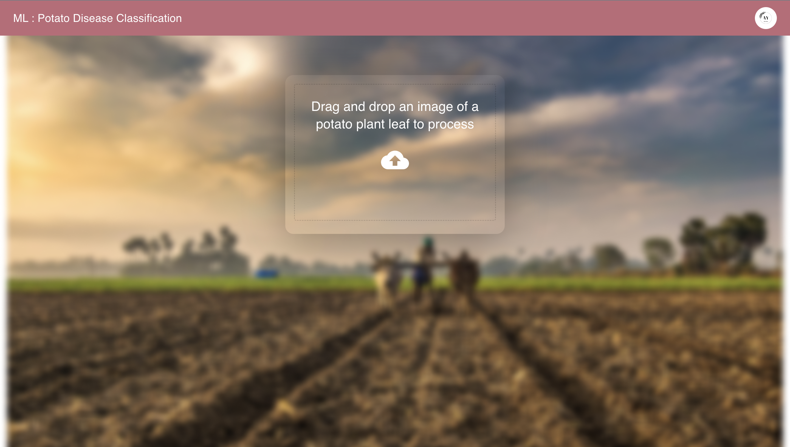

# Potato-Disease-Prediction
# Potato Disease Prediction Web Application

[]([https://www.example.com/video-url](https://drive.google.com/file/d/1tln923L1Y-LwUy7_KAykUPHOX53qVZOP/view?usp=sharing))

## Table of Contents
- [Introduction](#introduction)
- [Project Overview](#project-overview)
- [Technologies Used](#technologies-used)
- [Dataset](#dataset)
- [Installation](#installation)
- [Usage](#usage)
- [Model Architecture](#model-architecture)
- [Web Application](#web-application)
- [Results](#results)
- [Contributors](#contributors)

## Introduction

This project focuses on predicting potato diseases using deep learning techniques. The application is designed as a full-stack web-based machine learning project, featuring a user-friendly frontend developed with ReactJS and a robust backend powered by uvicorn. The heart of the disease prediction is a deep learning model implemented using TensorFlow.

## Project Overview

Potato disease prediction is crucial for farmers to ensure the health and yield of their potato crops. This project offers an easy-to-use web application where users can upload images of potato plants or leaves. The application then processes the image using a deep learning model to predict if the potato is healthy or affected by a disease. The model can detect common potato diseases, such as Late Blight, Early Blight, and more.

## Technologies Used

The project utilizes the following technologies and tools:

- Backend:
  - uvicorn (ASGI server)
  - FastAPI (Python framework)
  - TensorFlow (Deep learning)
  
- Frontend:
  - ReactJS
  - HTML/CSS
  - JavaScript
  
- Deployment:
  - Docker (optional)
  - Hosting platform of your choice (e.g., AWS, Heroku)

## Dataset

The deep learning model was trained on a dataset containing thousands of labeled images of healthy potatoes and potatoes with various diseases. The dataset is not included in this repository but can be obtained from [source link] (if applicable).

## Installation

To run this project locally, follow these steps :

1. Clone this repository to your local machine:      
   ``` git clone https://github.com/yourusername/potato-disease-prediction.git```
2. Navigate to the project directory :          
   ```cd potato-disease-prediction```     
3. Install the required Python libraries for the backend :           
   ```pip install uvicorn fastapi tensorflow```      
4. Install the required Node.js packages for the frontend :         
   ```cd frontend```              
    ```npm install```    


## Usage 
1. Start the uvicorn ASGI server for the backend :
  ``` uvicorn main:app --reload```     

2. Start the ReactJS development server for the frontend :
   ```cd frontend```   
    ```npm start```
   
3. Access the web application in your web browser at  ```http://localhost:3000```


## Model Architecture
The deep learning model used for potato disease prediction is based on a convolutional neural network (CNN) architecture. The model has been trained on a labeled dataset of potato images to learn to classify them as healthy or diseased.


## Web Application
The web application provides a user-friendly interface for users to:

- Upload images of potato plants or leaves.    
- View predictions for potato health and disease.   
- Receive recommendations and information on disease management.


## Results
The deep learning model has demonstrated impressive accuracy in predicting potato diseases. The results are as follows:

Overall accuracy: 0.9965277910232544%   
Specific disease detection accuracy:    
Late Blight:0.9965277912422544%   
Early Blight: 0.9965277910232544%


## Contributors
[Akash Yadav](https://www.linkedin.com/in/akash7017/)
- Akash Yadav 


